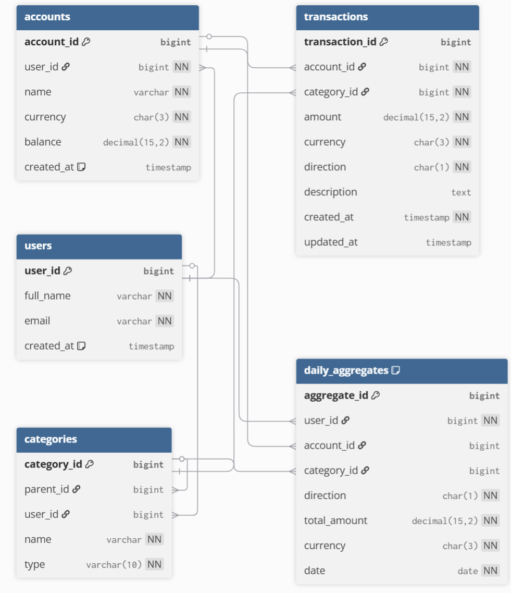

## Задание 1: Проектирование базы данных

### Сущности и связи

**Таблицы:**

1. **`user`** — пользователи системы
2. **`account`** — счета пользователя (наличные, карта, депозит)
3. **`category`** — категории доходов/расходов
4. **`transaction`** — операции (доход/расход/перевод)
5. **`daily_aggregate`** — агрегированные данные по дням для ускорения отчётов

### Схема (DDL-описание)

```sql
// 1. Пользователи
Table users {
  user_id    bigint [primary key]
  full_name  varchar [not null]
  email      varchar [not null, unique]
  created_at timestamp [default: `CURRENT_TIMESTAMP`]
}

// 2. Счета пользователей
Table accounts {
  account_id bigint [primary key]
  user_id    bigint [not null, ref: > users.user_id]
  name       varchar [not null]
  currency   char(3) [not null]           // RUB, USD, EUR
  balance    decimal(15,2) [not null]
  created_at timestamp [default: `CURRENT_TIMESTAMP`]
}

// 3. Категории (иерархические, общие или пользовательские)
Table categories {
  category_id bigint [primary key]
  parent_id   bigint [ref: > categories.category_id, null]
  user_id     bigint [ref: > users.user_id, null]   // NULL = системная категория
  name        varchar [not null]
  type        varchar(10) [not null]                // 'income' или 'expense'
}

// 4. Транзакции (самая большая таблица)
Table transactions {
  transaction_id bigint [primary key]
  account_id     bigint [not null, ref: > accounts.account_id]
  category_id    bigint [not null, ref: > categories.category_id]
  amount         decimal(15,2) [not null]
  currency       char(3) [not null]
  direction      char(1) [not null]                 // 'I' = Income, 'E' = Expense
  description    text
  created_at     timestamp [not null]
  updated_at     timestamp
}

// 5. Агрегированные данные по дням (для ускорения отчётов)
Table daily_aggregates {
  aggregate_id bigint [primary key]
  user_id      bigint [not null, ref: > users.user_id]
  account_id   bigint [ref: > accounts.account_id, null]
  category_id  bigint [ref: > categories.category_id, null]
  direction    char(1) [not null]                  // 'I' или 'E'
  total_amount decimal(15,2) [not null]
  currency     char(3) [not null]
  date         date [not null]

  indexes {
    (user_id, account_id, category_id, date, currency) [unique]
  }
}
```



---

## Задание 2: Партиционирование

**Самая большая таблица**  
`transaction` – быстро растёт, типично 10–100 тысяч записей на пользователя в год.

### Стратегия партиционирования

- **Тип**: Range partitioning (диапазонное)
- **Критерий**: `created_at` по месяцам
- **Структура**:

  ```sql
  -- Пример для PostgreSQL
  CREATE TABLE transaction (
      ...
  ) PARTITION BY RANGE (created_at);

  CREATE TABLE transaction_2024_01 PARTITION OF transaction
      FOR VALUES FROM ('2024-01-01') TO ('2024-02-01');

  CREATE TABLE transaction_2024_02 PARTITION OF transaction
      FOR VALUES FROM ('2024-02-01') TO ('2024-03-01');
  ...
  ```

### Обоснование

- **Типичные запросы**: отчёты за период (`WHERE created_at BETWEEN ...`), фильтр по дате.
- Партиционирование по дате позволяет:
  - быстро удалять старые данные (отсоединить партицию)
  - сканировать только нужный диапазон
- Индексы внутри партиций меньше и эффективнее.

### Какие запросы ускоряются

- `SELECT SUM(amount) FROM transaction WHERE created_at >= '2024-01-01' AND created_at < '2024-02-01'`
- `DELETE FROM transaction WHERE created_at < '2023-01-01'`
- Отчёты по году или месяцу.

---

## Задание 3: Шардирование

### Способ шардирования

- **Способ**: Hash-шардирование по `user_id`
- **Ключ**: `user_id`
- **Алгоритм**: `shard_id = hash(user_id) % N`

### Количество шардов

Начально: **4 шарда** (можно увеличивать позже).

### Определение нужного шарда

Приложение вычисляет:

```
shard_index = CRC32(user_id) % 4
```

и подключается к соответствующей базе данных.

### Где хранятся данные пользователя

**Все данные одного пользователя целиком на одном шарде**:

- Таблицы: `user`, `account`, `category` (если свои), `transaction`, `daily_aggregate`
- Это обеспечивает ACID в пределах одного пользователя без распределённых транзакций.

### Схема распределения

| Шард | Хеш % 4 | user_id (пример) |
| ---- | ------- | ---------------- |
| 0    | 0       | 4, 8, 12…        |
| 1    | 1       | 1, 5, 9…         |
| 2    | 2       | 2, 6, 10…        |
| 3    | 3       | 3, 7, 11…        |

---

## Задание 4: Репликация

### Структура

Для **каждого шарда** используется **Master-Slave репликация** (асинхронная или синхронная).

```
Шард 0: Master (запись) → Replica (чтение)
Шард 1: Master → Replica
Шард 2: Master → Replica
Шард 3: Master → Replica
```

### Куда идут записи?

- **Только на мастер** соответствующего шарда.

### Откуда читаются данные?

- Чтение по умолчанию с **реплики** (для снижения нагрузки на мастер).
- Для критически важных операций (проверка баланса перед записью) – с **мастера**, чтобы избежать репликационной задержки.

### Поведение при сбоях

- **Сбой мастера**:
  - Автоматический переключение на реплику (повышение до мастера).
  - Приложение перенаправляет запись на новый мастер.
- **Сбой реплики**:
  - Чтение временно идёт с мастера.
  - Реплика восстанавливается из бекапа или заново синхронизируется.

---

## Задание 5: Архитектура системы

```
┌─────────────────────────────────────────────────────────┐
│                    Клиент (Web / Mobile)                 │
└─────────────────────────┬───────────────────────────────┘
                          │
                          ▼
┌─────────────────────────────────────────────────────────┐
│                API Gateway / Балансировщик               │
│                   (NGINX / Kong / LB)                    │
└─────────────────────────┬───────────────────────────────┘
                          │
                          ▼
┌─────────────────────────────────────────────────────────┐
│            Сервис-роутер (шардирование по user_id)       │
│              hash(user_id) % 4 → номер шарда             │
└─────────────────────────┬───────────────────────────────┘
                          │
        ┌─────────────────┼─────────────────┐
        │                 │                 │
        ▼                 ▼                 ▼                 ▼
┌──────────────┐  ┌──────────────┐  ┌──────────────┐  ┌──────────────┐
│   Шард 0     │  │   Шард 1     │  │   Шард 2     │  │   Шард 3     │
│ ┌──────────┐ │  │ ┌──────────┐ │  │ ┌──────────┐ │  │ ┌──────────┐ │
│ │  Master  │ │  │ │  Master  │ │  │ │  Master  │ │  │ │  Master  │ │
│ │  (запись)│ │  │ │  (запись)│ │  │ │  (запись)│ │  │ │  (запись)│ │
│ └────┬─────┘ │  │ └────┬─────┘ │  │ └────┬─────┘ │  │ └────┬─────┘ │
│      │       │  │      │       │  │      │       │  │      │       │
│      ▼       │  │      ▼       │  │      ▼       │  │      ▼       │
│ ┌──────────┐ │  │ ┌──────────┐ │  │ ┌──────────┐ │  │ ┌──────────┐ │
│ │ Replica  │ │  │ │ Replica  │ │  │ │ Replica  │ │  │ │ Replica  │ │
│ │ (чтение) │ │  │ │ (чтение) │ │  │ │ (чтение) │ │  │ │ (чтение) │ │
│ └──────────┘ │  │ └──────────┘ │  │ └──────────┘ │  │ └──────────┘ │
└──────────────┘  └──────────────┘  └──────────────┘  └──────────────┘
        │                 │                 │                 │
        └─────────────────┴─────────────────┴─────────────────┘
                          │
                          ▼
┌─────────────────────────────────────────────────────────┐
│   Репликация: асинхронная (Master → Replica внутри шарда)│
│   Failover: при сбое Master → повышение Replica         │
└─────────────────────────────────────────────────────────┘
```

**Компоненты:**

- **Приложение** не знает о шардах, обращается к сервису роутинга.
- **Роутер** вычисляет шард и направляет запрос.
- **Каждый шард** – отдельный PostgreSQL (или MySQL) с партиционированием внутри таблицы `transaction`.
- **Репликация** – встроенная СУБД (streaming replication в PostgreSQL).

---

## Задание 6: Анализ

### 1. Почему выбран hash-шардинг по user_id?

- Данные одного пользователя компактны и сильно связаны (счета → транзакции).
- Hash-шардинг даёт равномерное распределение нагрузки, в отличие от range (где активные пользователи попадают в один шард).
- Простота маршрутизации и масштабирования (хотя при изменении числа шардов требуется решардинг).

### 2. Какие преимущества даёт партиционирование?

- Ускорение запросов с фильтром по дате за счёт partition.
- Легкое удаление старых данных (`DROP PARTITION` вместо `DELETE`).
- Улучшение обслуживания (можно делать VACUUM/REINDEX на одной партиции).
- Лучшая локальность данных на диске.

### 3. Возможные проблемы системы

- **Ручной решардинг** при добавлении новых шардов – миграция данных сложна.
- **Горячие ключи** (один очень активный пользователь) – нагрузка на один шард.
- **Репликационная задержка** – чтение с реплики может показывать устаревший баланс.
- **Ограниченные кросс-шардовые запросы** (например, перевод между счетами разных пользователей – сложно).
- **Партиционирование требует планирования** (выбор границ, управление новыми партициями).

### 4. Способы масштабирования (добавление шардов, балансировка)

- **Увеличение числа шардов** с 4 до 8:
  - Использовать **consistent hashing** или двойное хеширование, чтобы мигрировать не все данные.
  - Либо применить **логическое шардирование** через middleware (Vitess, Citus), поддерживающее ребалансировку.
- **Балансировка нагрузки**:
  - Добавить реплики для чтения внутри каждого шарда.
  - Использовать роутинг на стороне приложения.
- **Горячий шард**: разделить его по субключу (например, `(user_id, account_id)`), но это усложнит запросы. Альтернатива – кеширование и асинхронная запись.
